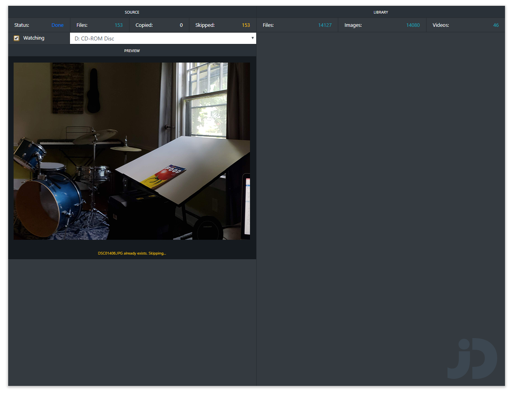

# jDoak

Software to help ditch those old photo CDs and floppy disks.

Only a preview screenshot is avaiable right now. I need to clean some things up and then I will push the source and provide a beta executable. 

This is still in development but contributions are welcome!

My original plan was to watch the removable media drive for new discs and start the backup automatically.  I am having trouble with this and may replpace this will a simple button to start the backup up when a disc is loaded.

